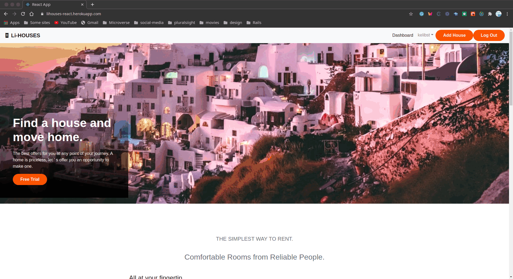

# li-houses-react
A basic npx create-react-app for the li-houses api


# Expectations
- Homepage fetches all hospitals from the api
- Each hospital detail page with reviews and review form 

- Basic Review management application
- Users can:
    - Add a new hospital
    - Update a hospital
    - Delete a hospital
    - Add a new review
    - Update and existing review
    - Delete and existing review

# Screenshot


# Live Demo
[Live Demo Link](https://li-houses-react.herokuapp.com/) 

[](https://www.loom.com/share/77ad47b927854afab0ef9d348ca6c8e4) 

# Built With

- HTML 
- CSS
- SCSS
- REACT-BOOTSTRAP
- NPM
- REACT
- NODE
- HEROKU
- ESLINT
- STYLELINT
- GITHUB ACTIONS

### Usage
- Clone the project 
```
git clone https://github.com/kelibst/hospitalreviews-react.git
```
- Run `npm install` to install the local dependencies
- Run `npm start` to launch local development server
- The project should launch in your default browser
- you can get the Rails [api](https://github.com/kelibst/review_manager) code here
- visit http://127.0.0.1:3000/
- You can also visit [live](https://hospitalreviews-react.herokuapp.com/) version for the full appp


## Authors

👤 **Kelly Booster**

- Github: [@kelibst](https://github.com/kelibst)
- Twitter: [@keli_booster](https://twitter.com/keli_booster)
- Linkedin: [Kekeli (Jiresse) Dogbevi
](https://www.linkedin.com/in/kekeli-dogbevi-jiresse/)


# 🤝 Contributing
Contributions, issues and feature requests are welcome!
Feel free to check the issues page

# Show your support
Give a ⭐️ if you like this project!

This project is [MIT](lic.url)